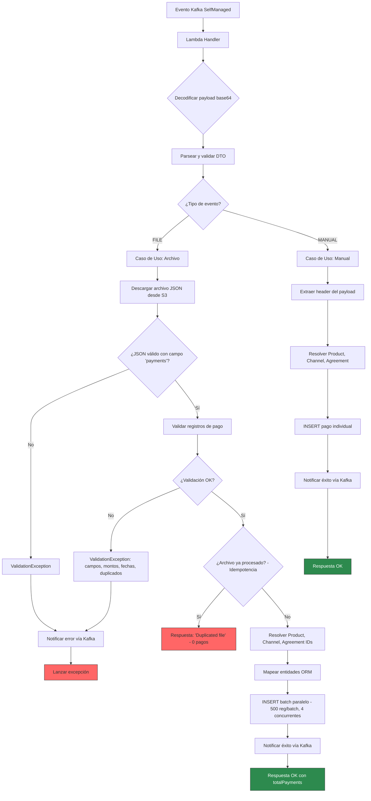

```mermaid
flowchart TD
    A[Evento Kafka SelfManaged] --> B[Lambda Handler]
    B --> C{Decodificar payload base64}
    C --> D[Parsear y validar DTO]
    D --> E{¿Tipo de evento?}
    
    E -->|FILE| F[Caso de Uso: Archivo]
    E -->|MANUAL| G[Caso de Uso: Manual]
    
    F --> F1[Descargar archivo JSON desde S3]
    F1 --> F2{¿JSON válido con campo 'payments'?}
    F2 -->|No| ERR1[ValidationException]
    F2 -->|Sí| F3[Validar registros de pago]
    
    F3 --> F4{¿Validación OK?}
    F4 -->|No| ERR2[ValidationException: campos, montos, fechas, duplicados]
    F4 -->|Sí| F5{¿Archivo ya procesado? - Idempotencia}
    
    F5 -->|Sí| F6[Respuesta: 'Duplicated file' - 0 pagos]
    F5 -->|No| F7[Resolver Product, Channel, Agreement IDs]
    
    F7 --> F8[Mapear entidades ORM]
    F8 --> F9[INSERT batch paralelo - 500 reg/batch, 4 concurrentes]
    F9 --> F10[Notificar éxito vía Kafka]
    F10 --> F11[Respuesta OK con totalPayments]
    
    G --> G1[Extraer header del payload]
    G1 --> G2[Resolver Product, Channel, Agreement]
    G2 --> G3[INSERT pago individual]
    G3 --> G4[Notificar éxito vía Kafka]
    G4 --> G5[Respuesta OK]
    
    ERR1 --> NOTIFY_ERR[Notificar error vía Kafka]
    ERR2 --> NOTIFY_ERR
    NOTIFY_ERR --> THROW[Lanzar excepción]
    
    style F6 fill:#f66,stroke:#333
    style F11 fill:#2d8a4e,stroke:#333,color:#fff
    style G5 fill:#2d8a4e,stroke:#333,color:#fff
    style THROW fill:#f66,stroke:#333
```
