# Standarize Consumer Initiate - Diagramas de Arquitectura

## Indice y Resumen

Este documento contiene 13 diagramas que describen la arquitectura completa del microservicio **Standarize Consumer Initiate**, un procesador de instrucciones de pago desplegado como AWS Lambda y activado por eventos Kafka.

| # | Diagrama | Que refleja |
|---|---|---|
| 1 | **Flow Diagram** | Vision general del flujo de datos desde la recepcion del evento Kafka hasta la respuesta final, mostrando las dos ramas de procesamiento (archivo y manual) y el manejo de errores con notificacion. |
| 2 | **Component Diagram** | Estructura de componentes organizada por capas (entry point, application, domain, ports, adapters, servicios externos), mostrando las dependencias entre ellos y como se conectan a la infraestructura. |
| 3 | **Sequence Diagram** | Interaccion temporal paso a paso entre todos los participantes del sistema para ambos flujos: procesamiento de archivo (3.1) con descarga S3, validacion y batch insert; y procesamiento manual (3.2) con construccion de pago desde DTO. |
| 4 | **Infrastructure Diagram** | Topologia de infraestructura AWS en produccion: Lambda dentro de VPC con subnets privadas, PostgreSQL, S3, Kafka self-managed, Parameter Store, y el pipeline CI/CD con GitLab. Incluye el esquema de base de datos y sus relaciones. |
| 5 | **Error Handling Flow** | Secuencia detallada de como se manejan los distintos tipos de error (storage, validacion, base de datos, publicacion Kafka), mostrando que siempre se publica un evento de error antes de re-lanzar la excepcion. |
| 6 | **Batch Processing Detail** | Mecanismo interno del repositorio para insertar grandes volumenes: verificacion de idempotencia, resolucion de referencias (producto, canal, convenio con cache), mapeo a entidades ORM, e insercion en batches de 500 con 4 operaciones concurrentes. |
| 7 | **Validation Rules Detail** | Arbol de decision completo del servicio de validacion de dominio: validacion estructural (array, longitud), validacion por registro (campos requeridos, monto numerico positivo, formato de fecha, unicidad de payment_id), y acumulacion de errores. |
| 8 | **NestJS Module Dependency Graph** | Grafo de dependencias entre todos los modulos NestJS del proyecto: HandlerModule como raiz, ConfigifyModule para secrets, y el feature module con sus sub-modulos (Database, Kafka, S3) y sus providers internos. |
| 9 | **Database Entity Relationship Diagram** | Modelo entidad-relacion completo de PostgreSQL con las 5 tablas (product, channel, agreement, payment_instruction, historical_payment), sus columnas, tipos de datos, claves primarias, foraneas y relaciones de cardinalidad. |
| 10 | **Cold Start vs Warm Start** | Comparacion secuencial entre la primera invocacion (cold start: creacion de contexto NestJS, conexion a DB, conexion a Kafka, cache de app) y las invocaciones subsiguientes (warm start: retorno inmediato de la instancia cacheada). |
| 11 | **Event Message Format** | Transformacion del mensaje a traves del sistema: evento Kafka de entrada (base64 encoded), payload decodificado con sus campos, y los dos posibles eventos de salida (exito con status OK, error con status ERROR y mensaje). |
| 12 | **Idempotency Strategy** | Estrategia de idempotencia en dos niveles: nivel archivo (lookup del primer payment_id para evitar re-procesamiento completo) y nivel registro (UNIQUE INDEX en payment_reference con orIgnore para manejar race conditions sin fallar). |
| 13 | **Docker Compose Local Environment** | Topologia del entorno de desarrollo local con Docker Compose: contenedores (Lambda, LocalStack, Kafka, Zookeeper, Kafka UI, PostgreSQL), scripts de inicializacion, health checks, y orden de arranque con dependencias. |

---

## 1. Flow Diagram
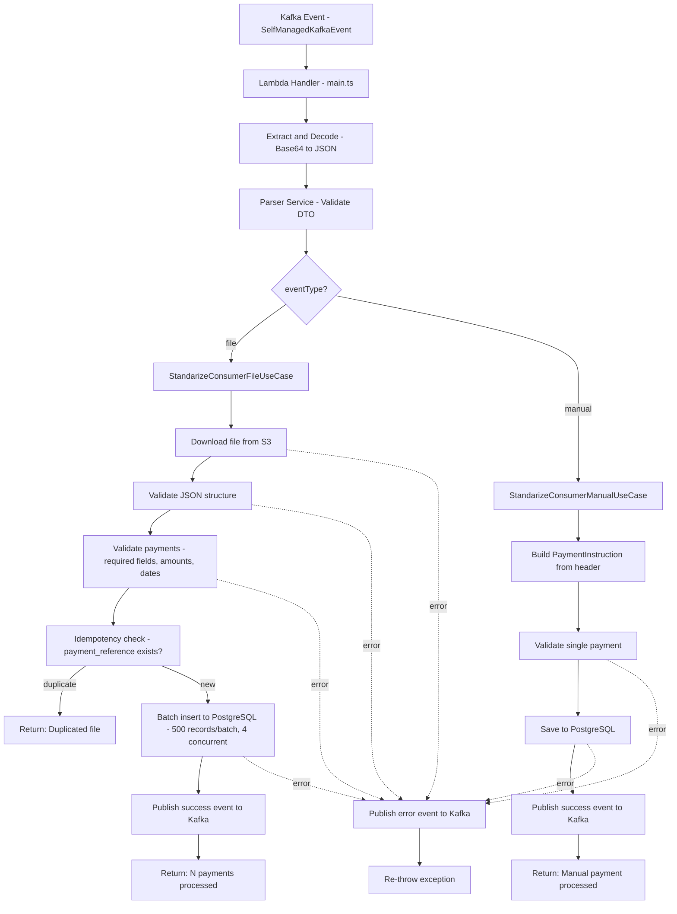

## 2. Component Diagram

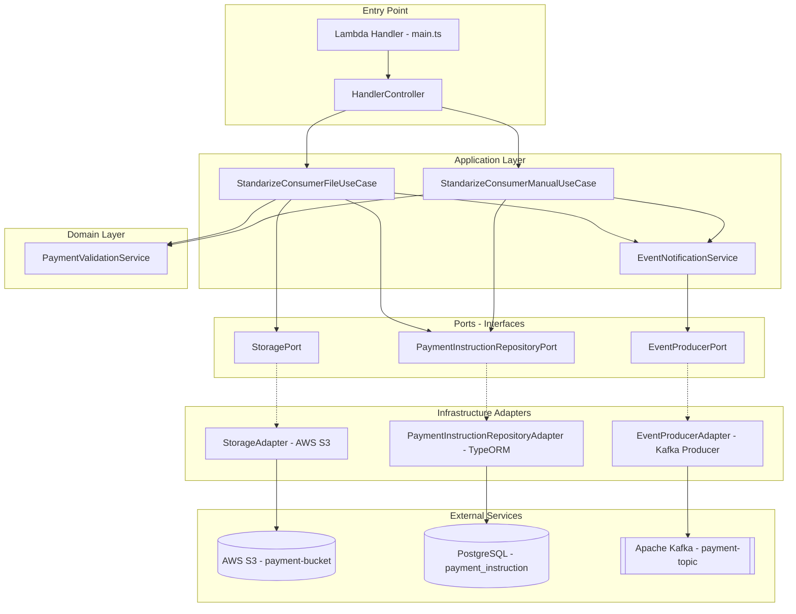

## 3. Sequence Diagram

### 3.1 File Flow

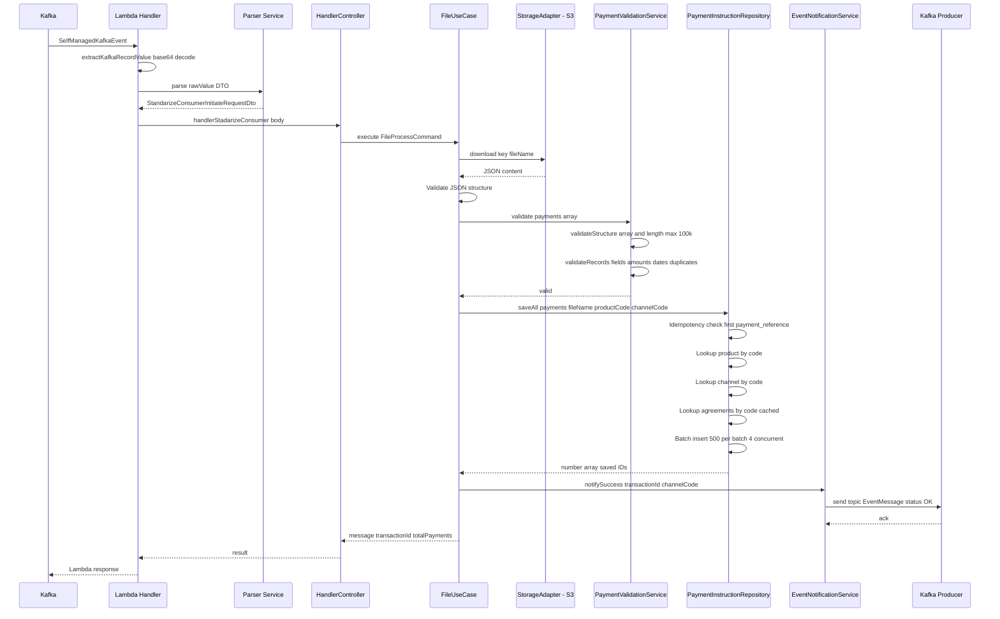

### 3.2 Manual Flow

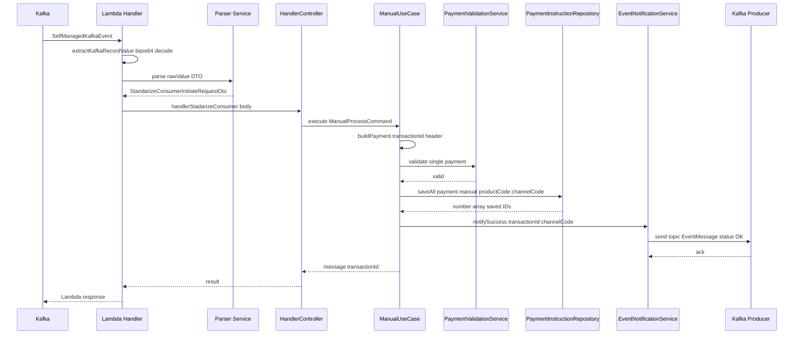

## 4. Infrastructure Diagram

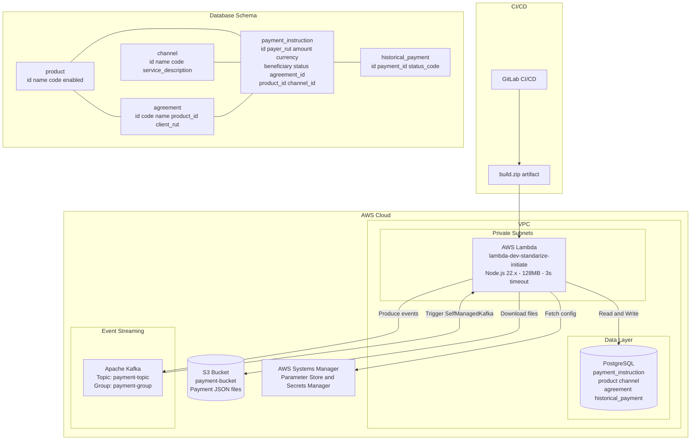

---

### Resumen de Tecnologias

| Componente | Tecnologia |
|---|---|
| Runtime | Node.js 22.x (AWS Lambda) |
| Framework | NestJS (Application Context) |
| Base de datos | PostgreSQL (TypeORM) |
| Storage | AWS S3 |
| Mensajeria | Apache Kafka (Self-Managed) |
| Configuracion | AWS Parameter Store / Secrets Manager |
| CI/CD | GitLab CI/CD |
| Contenedor build | Docker (Alpine + zip) |

---

## 5. Error Handling Flow

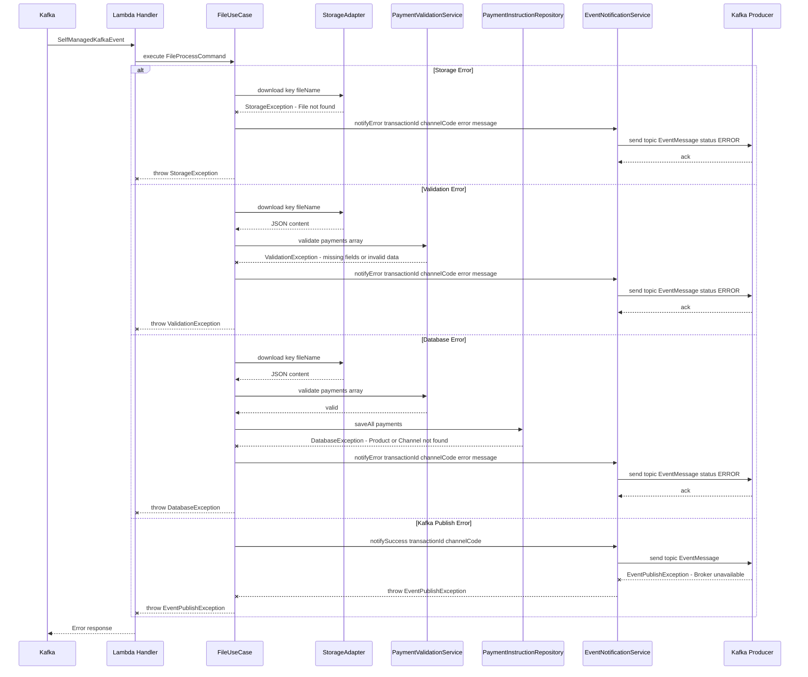

## 6. Batch Processing Detail

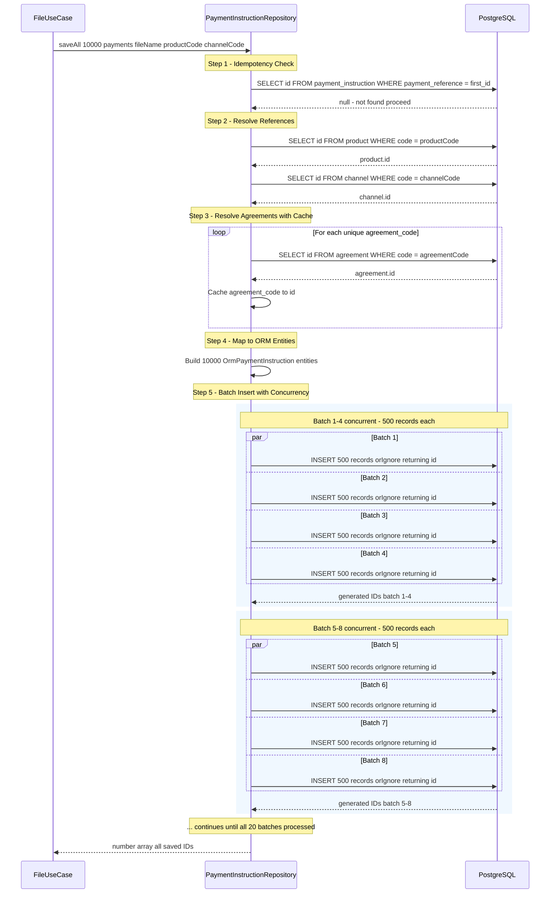

## 7. Validation Rules Detail

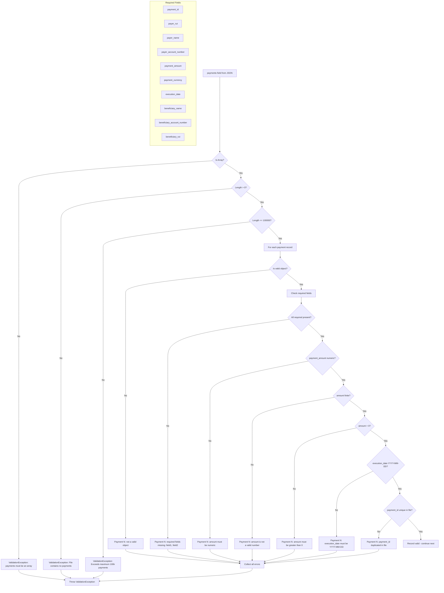

## 8. NestJS Module Dependency Graph

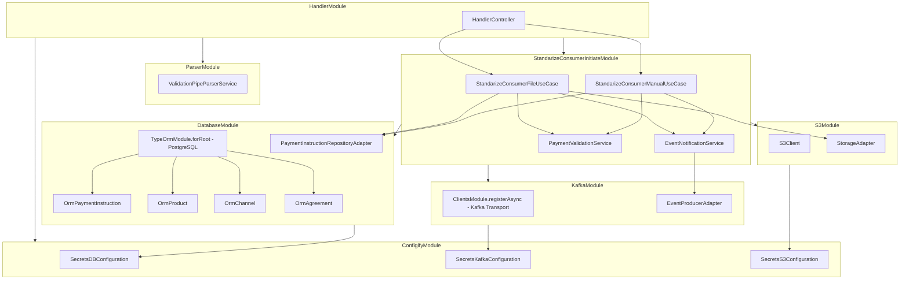

## 9. Database Entity Relationship Diagram

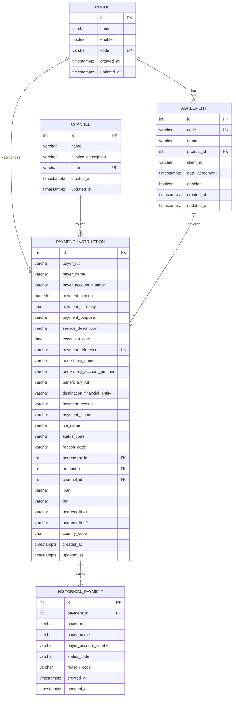

## 10. Cold Start vs Warm Start

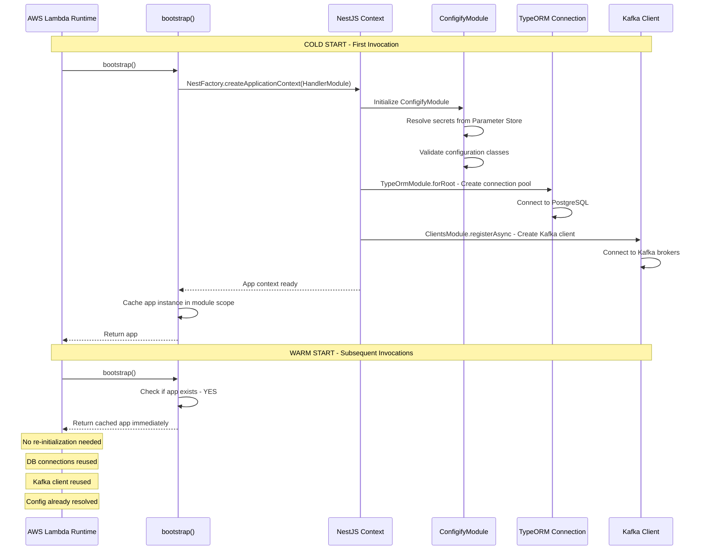

## 11. Event Message Format

```mermaid
flowchart LR
    subgraph Input_Event[Input - SelfManagedKafkaEvent]
        direction TB
        IE1[eventSource: SelfManagedKafka]
        IE2[bootstrapServers: broker:29092]
        IE3[records: topic-partition array]
        IE4[record.value: base64 encoded JSON]
    end

    subgraph Decoded_Payload[Decoded Payload]
        direction TB
        DP1[timestamp: ISO 8601]
        DP2[transactionId: UUID]
        DP3[eventType: file or manual]
        DP4[product_code: TEF PAP NOM TIN PAY]
        DP5[channel_code: WEB H2H API]
        DP6[payload: FilePayload or ManualPayload]
    end

    subgraph Output_Success[Output Event - Success]
        direction TB
        OS1[timestamp: ISO 8601]
        OS2[hashId: transactionId]
        OS3[channelId: channelCode]
        OS4[eventType: standarize-consume]
        OS5["payload: { status: OK }"]
    end

    subgraph Output_Error[Output Event - Error]
        direction TB
        OE1[timestamp: ISO 8601]
        OE2[hashId: transactionId]
        OE3[channelId: channelCode]
        OE4[eventType: standarize-consume]
        OE5["payload: { status: ERROR, error: message }"]
    end

    Input_Event -->|base64 decode + JSON parse| Decoded_Payload
    Decoded_Payload -->|processing success| Output_Success
    Decoded_Payload -->|processing failure| Output_Error
```

## 12. Idempotency Strategy

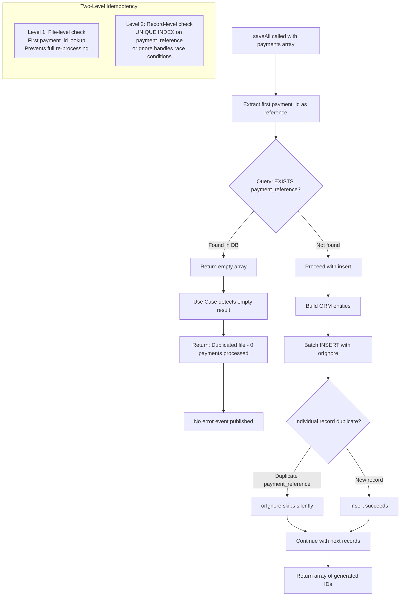

## 13. Docker Compose Local Environment

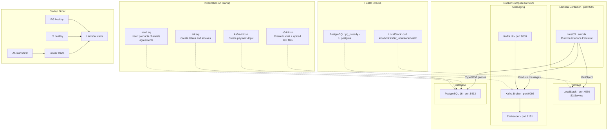
