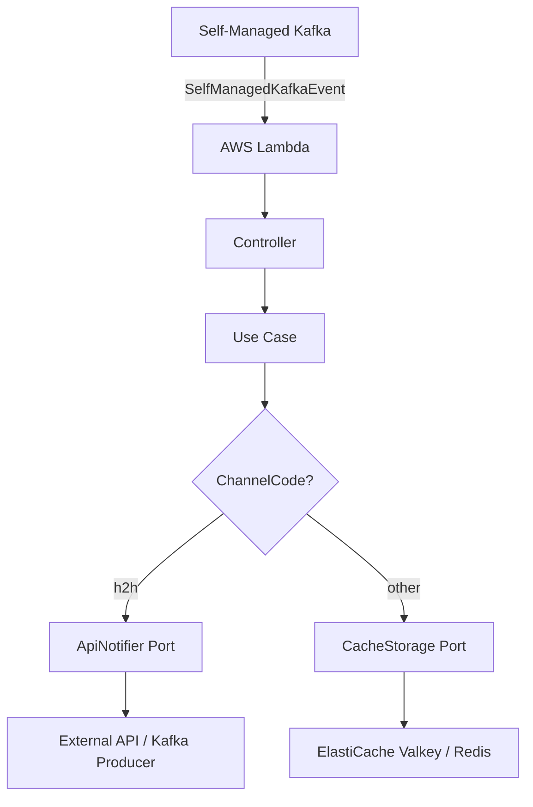
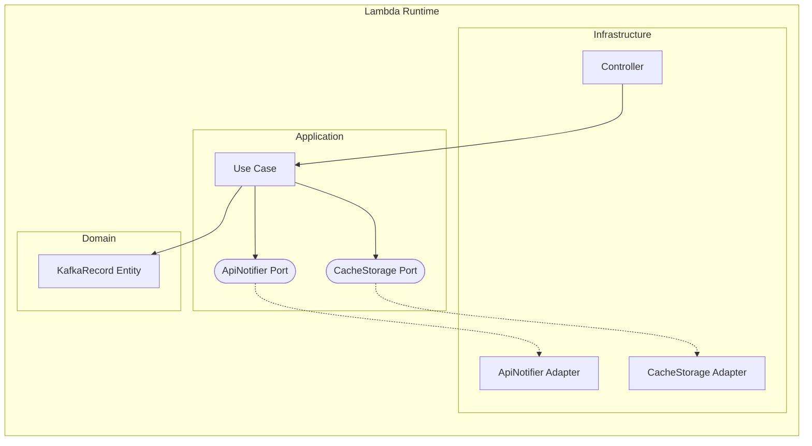
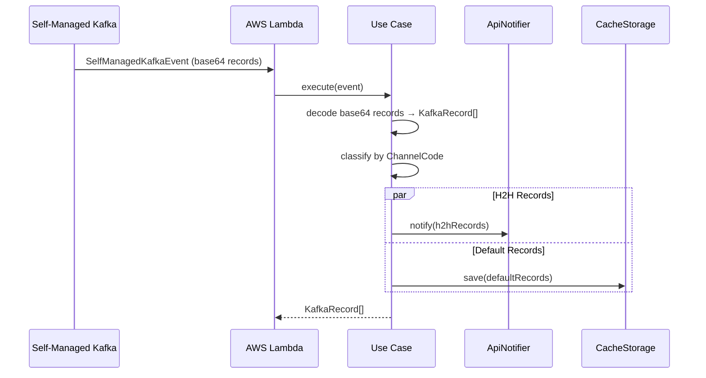
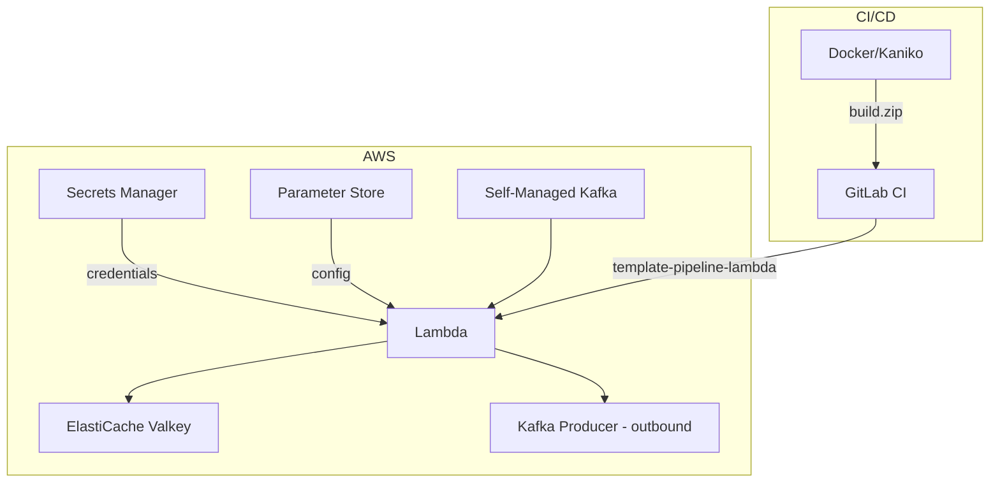

# Standarize Consumer Finished — Architecture

## Flow Diagram

```mermaid
flowchart TD
    A[Self-Managed Kafka] -->|SelfManagedKafkaEvent| B[AWS Lambda]
    B --> C[Controller]
    C --> D[Use Case]
    D --> E{ChannelCode?}
    E -->|h2h| F[ApiNotifier Port]
    E -->|other| G[CacheStorage Port]
    F --> H[External API / Kafka Producer]
    G --> I[ElastiCache Valkey / Redis]
```

## Component Diagram

```mermaid
graph LR
    subgraph Lambda Runtime
        subgraph Infrastructure
            CTRL[Controller]
            AN[ApiNotifier Adapter]
            CS[CacheStorage Adapter]
        end
        subgraph Application
            UC[Use Case]
            P1([ApiNotifier Port])
            P2([CacheStorage Port])
        end
        subgraph Domain
            KR[KafkaRecord Entity]
        end
    end

    CTRL --> UC
    UC --> P1
    UC --> P2
    P1 -.-> AN
    P2 -.-> CS
    UC --> KR
```

## Sequence Diagram

```mermaid
sequenceDiagram
    participant Kafka as Self-Managed Kafka
    participant Lambda as AWS Lambda
    participant UC as Use Case
    participant API as ApiNotifier
    participant Cache as CacheStorage

    Kafka->>Lambda: SelfManagedKafkaEvent (base64 records)
    Lambda->>UC: execute(event)
    UC->>UC: decode base64 records → KafkaRecord[]
    UC->>UC: classify by ChannelCode

    par H2H Records
        UC->>API: notify(h2hRecords)
    and Default Records
        UC->>Cache: save(defaultRecords)
    end

    UC-->>Lambda: KafkaRecord[]
```

## Infrastructure

```mermaid
graph TB
    subgraph AWS
        SM[Secrets Manager] --> |credentials| L[Lambda]
        PS[Parameter Store] --> |config| L
        L --> V[ElastiCache Valkey]
        K[Self-Managed Kafka] --> L
        L --> K2[Kafka Producer - outbound]
    end

    subgraph CI/CD
        GL[GitLab CI] --> |template-pipeline-lambda| L
        D[Docker/Kaniko] --> |build.zip| GL
    end
```
