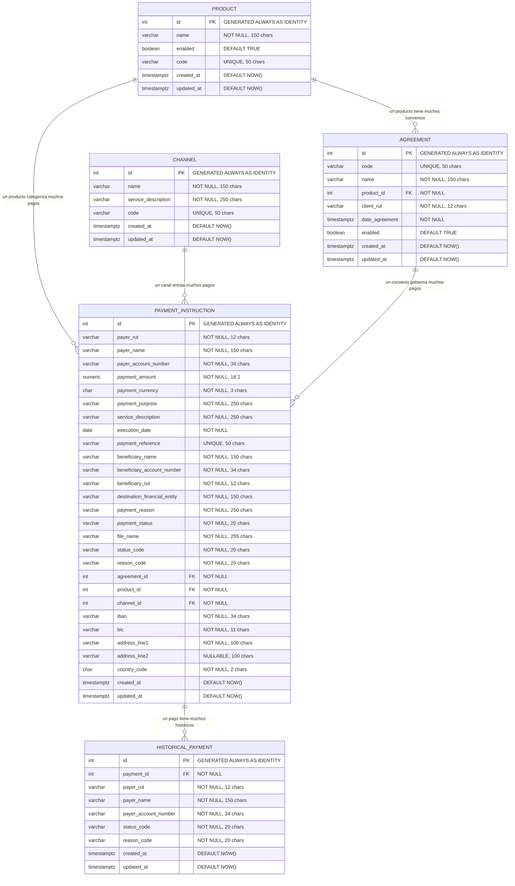

# Modelo de Datos

## Overview

El modelo de datos del microservicio **Standarize Consumer Initiate** esta implementado en PostgreSQL y consta de 5 tablas organizadas en dos grupos:

- **Tablas maestras** (configuracion): `product`, `channel`, `agreement`
- **Tablas transaccionales** (operacion): `payment_instruction`, `historical_payment`

Las tablas maestras se pre-cargan con datos semilla y raramente cambian. Las tablas transaccionales crecen con cada evento procesado.

## Diagrama Entidad-Relacion



---

## Tablas Maestras

### product

Catalogo de productos financieros disponibles en el sistema.

| Columna | Tipo | Restriccion | Descripcion |
|---|---|---|---|
| `id` | INT | PK, IDENTITY | Identificador auto-generado |
| `name` | VARCHAR(150) | NOT NULL | Nombre descriptivo del producto |
| `enabled` | BOOLEAN | DEFAULT TRUE | Indica si el producto esta activo |
| `code` | VARCHAR(50) | UNIQUE, NOT NULL | Codigo unico del producto (clave de negocio) |
| `created_at` | TIMESTAMPTZ | DEFAULT NOW() | Fecha de creacion |
| `updated_at` | TIMESTAMPTZ | DEFAULT NOW() | Fecha de ultima actualizacion |

**Datos semilla:**

| code | name |
|---|---|
| TEF | Transferencia Nacional |
| PAP | Pago Proveedores |
| NOM | Pago Nomina |
| TIN | Transferencia Internacional |
| PAY | Pago General |

**Uso en el sistema:** El campo `product_code` del evento Kafka se resuelve contra esta tabla para obtener el `id` numerico que se almacena en `payment_instruction.product_id`.

---

### channel

Catalogo de canales por los cuales ingresan las instrucciones de pago.

| Columna | Tipo | Restriccion | Descripcion |
|---|---|---|---|
| `id` | INT | PK, IDENTITY | Identificador auto-generado |
| `name` | VARCHAR(150) | NOT NULL | Nombre del canal |
| `service_description` | VARCHAR(250) | NOT NULL | Descripcion del servicio que provee |
| `code` | VARCHAR(50) | UNIQUE, NOT NULL | Codigo unico del canal (clave de negocio) |
| `created_at` | TIMESTAMPTZ | DEFAULT NOW() | Fecha de creacion |
| `updated_at` | TIMESTAMPTZ | DEFAULT NOW() | Fecha de ultima actualizacion |

**Datos semilla:**

| code | name | service_description |
|---|---|---|
| WEB | Portal Web | Canal de pagos via portal web corporativo |
| H2H | H2H | Canal Host-to-Host para integraciones directas |
| API | API | Canal de pagos via API REST |

**Uso en el sistema:** El campo `channel_code` del evento Kafka se resuelve contra esta tabla para obtener el `id` numerico que se almacena en `payment_instruction.channel_id`.

---

### agreement

Convenios comerciales que vinculan un cliente (por RUT) con un producto financiero.

| Columna | Tipo | Restriccion | Descripcion |
|---|---|---|---|
| `id` | INT | PK, IDENTITY | Identificador auto-generado |
| `code` | VARCHAR(50) | UNIQUE, NOT NULL | Codigo unico del convenio (clave de negocio) |
| `name` | VARCHAR(150) | NOT NULL | Nombre descriptivo del convenio |
| `product_id` | INT | FK → product(id), NOT NULL | Producto asociado al convenio |
| `client_rut` | VARCHAR(12) | NOT NULL | RUT del cliente titular del convenio |
| `date_agreement` | TIMESTAMPTZ | NOT NULL | Fecha de firma del convenio |
| `enabled` | BOOLEAN | DEFAULT TRUE | Indica si el convenio esta vigente |
| `created_at` | TIMESTAMPTZ | DEFAULT NOW() | Fecha de creacion |
| `updated_at` | TIMESTAMPTZ | DEFAULT NOW() | Fecha de ultima actualizacion |

**Indices:**
- `idx_agreement_product` en `product_id`

**Datos semilla:**

| code | name | product | client_rut |
|---|---|---|---|
| AGR-001 | Convenio TEF Empresa Alpha | TEF | 76.123.456-7 |
| AGR-002 | Convenio Proveedores Empresa Alpha | PAP | 76.123.456-7 |
| AGR-003 | Convenio Nomina Empresa Beta | NOM | 77.987.654-3 |
| AGR-004 | Convenio Pago General Empresa Alpha | PAY | 76.123.456-7 |

**Uso en el sistema:** El campo `agreement_code` de cada pago se resuelve contra esta tabla. El repositorio usa un cache en memoria (`Map<string, number>`) para evitar queries repetitivas cuando multiples pagos del mismo archivo referencian el mismo convenio.

---

## Tablas Transaccionales

### payment_instruction

Tabla principal del sistema. Almacena cada instruccion de pago procesada, ya sea proveniente de un archivo masivo o de un pago manual.

| Columna | Tipo | Restriccion | Descripcion |
|---|---|---|---|
| `id` | INT | PK, IDENTITY | Identificador auto-generado |
| `payer_rut` | VARCHAR(12) | NOT NULL | RUT del pagador |
| `payer_name` | VARCHAR(150) | NOT NULL | Nombre del pagador |
| `payer_account_number` | VARCHAR(34) | NOT NULL | Numero de cuenta del pagador |
| `payment_amount` | NUMERIC(18,2) | NOT NULL | Monto del pago |
| `payment_currency` | CHAR(3) | NOT NULL | Moneda ISO 4217 (CLP, USD, etc.) |
| `payment_purpose` | VARCHAR(250) | NOT NULL | Proposito del pago |
| `service_description` | VARCHAR(250) | NOT NULL | Descripcion del servicio |
| `execution_date` | DATE | NOT NULL | Fecha programada de ejecucion |
| `payment_reference` | VARCHAR(50) | UNIQUE, NOT NULL | Referencia unica del pago (idempotencia) |
| `beneficiary_name` | VARCHAR(150) | NOT NULL | Nombre del beneficiario |
| `beneficiary_account_number` | VARCHAR(34) | NOT NULL | Cuenta del beneficiario |
| `beneficiary_rut` | VARCHAR(12) | NOT NULL | RUT del beneficiario |
| `destination_financial_entity` | VARCHAR(150) | NOT NULL | Entidad financiera destino |
| `payment_reason` | VARCHAR(250) | NOT NULL | Razon del pago |
| `payment_status` | VARCHAR(20) | NOT NULL | Estado actual (PENDING, etc.) |
| `file_name` | VARCHAR(255) | NOT NULL | Nombre del archivo origen o "manual" |
| `status_code` | VARCHAR(20) | NOT NULL | Codigo de estado interno (NEW, etc.) |
| `reason_code` | VARCHAR(20) | NOT NULL | Codigo de razon (vacio al crear) |
| `agreement_id` | INT | FK → agreement(id), NOT NULL | Convenio asociado |
| `product_id` | INT | FK → product(id), NOT NULL | Producto asociado |
| `channel_id` | INT | FK → channel(id), NOT NULL | Canal de ingreso |
| `iban` | VARCHAR(34) | NOT NULL | IBAN del beneficiario |
| `bic` | VARCHAR(11) | NOT NULL | Codigo BIC/SWIFT |
| `address_line1` | VARCHAR(100) | NOT NULL | Direccion linea 1 |
| `address_line2` | VARCHAR(100) | NULLABLE | Direccion linea 2 |
| `country_code` | CHAR(2) | NOT NULL | Codigo de pais ISO 3166-1 |
| `created_at` | TIMESTAMPTZ | DEFAULT NOW() | Fecha de creacion |
| `updated_at` | TIMESTAMPTZ | DEFAULT NOW() | Fecha de ultima actualizacion |

**Indices:**

| Indice | Columna(s) | Tipo | Proposito |
|---|---|---|---|
| `idx_payment_reference` | `payment_reference` | UNIQUE | Idempotencia - evitar pagos duplicados |
| `idx_payment_status` | `payment_status` | Normal | Consultas por estado |
| `idx_payment_execution_date` | `execution_date` | Normal | Consultas por fecha de ejecucion |
| `idx_payment_product` | `product_id` | Normal | Filtrado por producto |
| `idx_payment_channel` | `channel_id` | Normal | Filtrado por canal |
| `idx_payment_agreement` | `agreement_id` | Normal | Filtrado por convenio |

**Valores iniciales al insertar:**
- `payment_status` = `'PENDING'`
- `status_code` = `'NEW'`
- `reason_code` = `''` (vacio)
- `file_name` = nombre del archivo S3 o `'manual'` para pagos manuales

**Estrategia de idempotencia:**
1. Antes de insertar, se verifica si el `payment_reference` del primer registro ya existe (nivel archivo)
2. El INSERT usa `orIgnore()` que silenciosamente omite registros cuyo `payment_reference` ya existe (nivel registro, via UNIQUE INDEX)

---

### historical_payment

Tabla de auditoria que registra cambios de estado en las instrucciones de pago. No es utilizada directamente por el flujo de `standarize-consumer-initiate`, pero esta preparada para flujos posteriores del pipeline de pagos.

| Columna | Tipo | Restriccion | Descripcion |
|---|---|---|---|
| `id` | INT | PK, IDENTITY | Identificador auto-generado |
| `payment_id` | INT | FK → payment_instruction(id), NOT NULL | Pago al que pertenece el historico |
| `payer_rut` | VARCHAR(12) | NOT NULL | RUT del pagador (snapshot) |
| `payer_name` | VARCHAR(150) | NOT NULL | Nombre del pagador (snapshot) |
| `payer_account_number` | VARCHAR(34) | NOT NULL | Cuenta del pagador (snapshot) |
| `status_code` | VARCHAR(20) | NOT NULL | Codigo de estado en ese momento |
| `reason_code` | VARCHAR(20) | NOT NULL | Codigo de razon del cambio |
| `created_at` | TIMESTAMPTZ | DEFAULT NOW() | Fecha del registro historico |
| `updated_at` | TIMESTAMPTZ | DEFAULT NOW() | Fecha de ultima actualizacion |

**Indices:**

| Indice | Columna(s) | Proposito |
|---|---|---|
| `idx_historical_payment_payment_id` | `payment_id` | Buscar historial de un pago |
| `idx_historical_payment_payer_rut` | `payer_rut` | Buscar historial por pagador |
| `idx_historical_payment_payer_account_number` | `payer_account_number` | Buscar historial por cuenta |

---

## Relaciones

```
product (1) ──────── (N) agreement
    Un producto puede tener multiples convenios asociados.

product (1) ──────── (N) payment_instruction
    Un producto categoriza multiples instrucciones de pago.

channel (1) ──────── (N) payment_instruction
    Un canal enruta multiples instrucciones de pago.

agreement (1) ────── (N) payment_instruction
    Un convenio gobierna multiples instrucciones de pago.

payment_instruction (1) ── (N) historical_payment
    Una instruccion de pago puede tener multiples registros historicos.
```

## Mapeo ORM (TypeORM)

El proyecto usa TypeORM con las siguientes entidades:

| Entidad ORM | Tabla | Archivo |
|---|---|---|
| `OrmProduct` | `product` | `entitiy-orm/product-orm.entity.ts` |
| `OrmChannel` | `channel` | `entitiy-orm/channel-orm.entity.ts` |
| `OrmAgreement` | `agreement` | `entitiy-orm/agreement-orm.entity.ts` |
| `OrmPaymentInstruction` | `payment_instruction` | `entitiy-orm/payment-orm.entity.ts` |

La conexion se configura via `TypeOrmModule.forRootAsync` usando la URL de conexion desde `SecretsDBConfiguration.URL_BD`.

## Consideraciones de Performance

- **Batch insert**: Se insertan 500 registros por batch con 4 batches concurrentes para maximizar throughput
- **Agreement cache**: Se usa un `Map<string, number>` para cachear la resolucion de `agreement_code` → `agreement_id` dentro de una misma ejecucion
- **orIgnore**: Los INSERT usan `ON CONFLICT DO NOTHING` para manejar duplicados sin lanzar excepciones
- **Indices estrategicos**: Los indices estan disenados para soportar las consultas mas frecuentes (por status, fecha, producto, canal, convenio) y la verificacion de idempotencia (payment_reference)

## Volumetria

El sistema esta disenado para manejar:
- Hasta **100,000 registros** por archivo
- Insercion optimizada con batches de 500 y concurrencia de 4
- Idempotencia a nivel de archivo y registro individual
