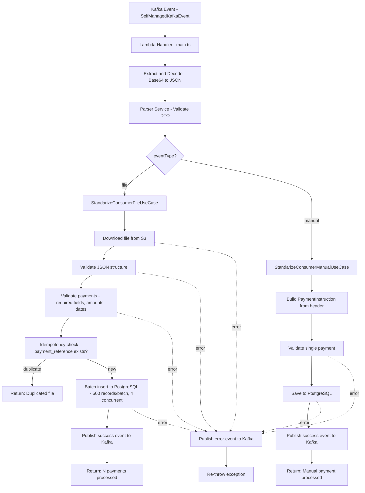
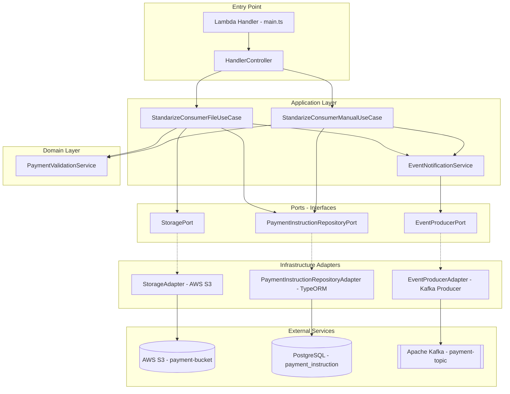
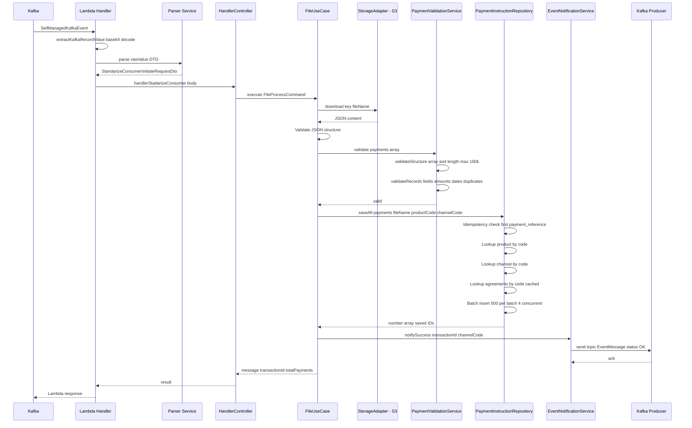
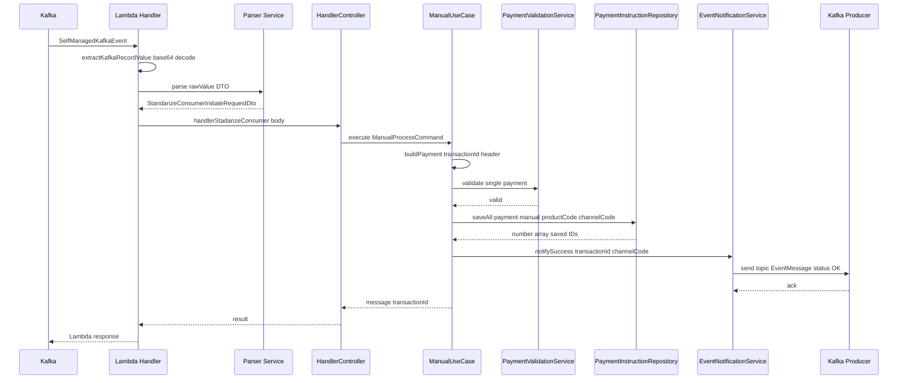
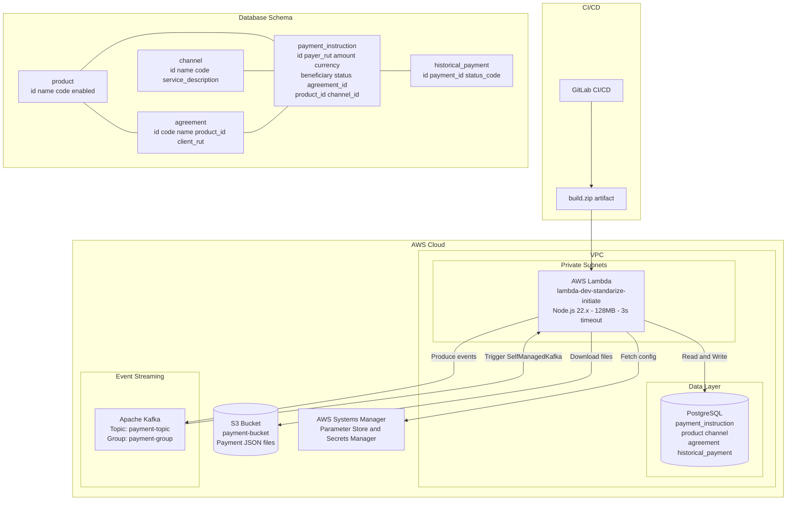

# Standarize Consumer Initiate - Diagramas de Arquitectura

## 1. Flow Diagram

## 2. Component Diagram

## 3. Sequence Diagram

### 3.1 File Flow

### 3.2 Manual Flow

## 4. Infrastructure Diagram

